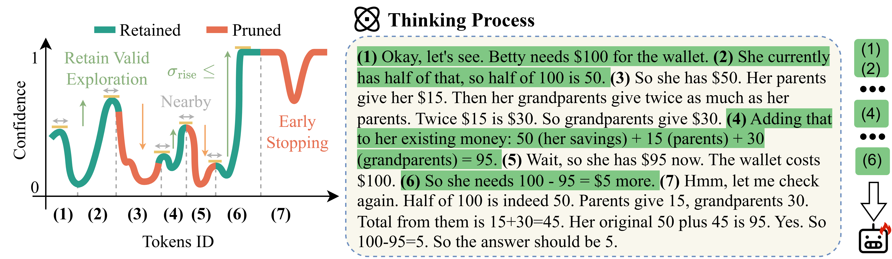
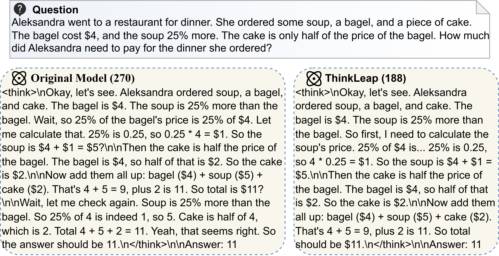

# ThinkLeap: Reasoning Optimization Through Confidence-Guided Cognitive Leap Extraction


Welcome to ThinkLeap! The following case illustrates the original model output and the ThinkLeap-trained output for the same question, showing identical reasoning logic with a shorter reasoning trace after ThinkLeap.



## Repository Layout (File Framework)

```
.
├── main_run_all.sh                 # Main entry: grid runner (datasets × models)
├── main_exp_one.sh                 # Example single-run pipeline (step1→step5)
├── general_run_all.sh              # Extra grid runner (older / special cases)
├── general_aime_amc.sh             # Extra helper (may contain machine-specific paths)
├── step1_inference_and_calculate_confidence.py  # Step 1: collect confidence traces
├── step2_replace_and_prune.py      # Step 2: compress thinking and write JSONL
├── step3_data2LLMfactory.py        # Step 3: JSONL → LLaMA-Factory SFT JSON
├── hf_2_step3.py                   # Utility: build full train/test JSON from datasets
├── step5_eval_vllm.py              # Evaluation via vLLM (supports LoRA adapters)
├── step5.5_eval_from_json.py       # Compute ACC / token stats from eval JSON
├── step5_example.sh                # Example evaluation commands
├── motivation_step1.5_plot_confidence.py  # Plot confidence/pruning diagnostics, save to ./plot_fig
├── motivation_token_freqency.py    # Token frequency analysis
├── utils/
│   ├── dataset_loader.py           # Dataset handlers + prompt building + answer extraction
│   ├── data_gen.py                 # Shared CLI args + pruning utilities + plotting helpers
│   ├── math_parsing_util.py        # Robust math answer normalization/comparison
│   ├── metric.py                   # AUC/ACC/ECE metrics for confidence-based evaluation
│   └── SPECIAL_SUFFIXS.py          # Model-specific suffix/EOS templates (LLaMA/Phi/Qwen/DeepSeek)
├── config/                         # LLaMA-Factory configs + LoRA export config
├── huggingface_datasets/           # Local dataset snapshots (used by some handlers)
├── huggingface_models/             # Local model weights (usually symlinks)
├── plot_fig/                       # Figures/plots output
├── step1_confidence_data/          # Step 1 outputs (token-level confidence logs)
├── step2_compressed_data/          # Step 2 outputs (compressed samples as JSONL)
├── step3_training_data/            # Step 3 outputs (LLaMA-Factory JSON + dataset_info.json)
├── step5_eval_data/                # Step 5 outputs (evaluation JSON)
├── saves/                          # Step 4 outputs (LLaMA-Factory checkpoints / LoRA adapters)
├── token_frequency_results/        # Token frequency outputs (generated by motivation_token_freqency.py)
└── cache*/                         # Caches (used to resume/accelerate runs)
```

## Quickstart

### 0) Prerequisites

- Python 3.11+ and one or more NVIDIA GPUs (CUDA).
- Install runtime dependencies used by the pipeline scripts:
```bash
pip install -r requirements.txt
```

- Training requires **LLaMA-Factory**.
```bash
git clone --depth 1 https://github.com/hiyouga/LLaMA-Factory.git
cd LLaMA-Factory
pip install -e .
```
If there are environment conflicts, try to resolve them using pip install --no-deps -e .
(our llamafactory verison is  0.9.5.dev0)

### 1) Models (required)

This project detects thinking blocks using `</think>`, so use a model family that reliably emits them (recommended: **Qwen**, **QwQ**, **DeepSeek-R1** derivatives).

Store model weights under `./huggingface_models/<MODEL_NAME>` (symlink recommended):

```bash
mkdir ./huggingface_models
ln -s /abs/path/to/huggingface_models/DeepSeek-R1-Distill-Qwen-1.5B ./huggingface_models/DeepSeek-R1-Distill-Qwen-1.5B
```

The folder name must match the `MODEL_NAME` set in `main_run_all.sh`.

### 2) Datasets (required)

Dataset routing lives in `utils/dataset_loader.py` (`get_dataset(dataset_name)`).

Common names used in this repo:
- `gsm8k`, `math500`, `arc_challenge`, `aime24`, `amc23`


These datasets are loaded from local snapshots in `./huggingface_datasets/` (e.g., GSM8K in this repo is referenced via `./huggingface_datasets/gsm8k/`).

## Running Experiments (Main Entry: `main_run_all.sh`)

`main_run_all.sh` is the orchestrator:
- Select GPU(s) via `CUDA_VISIBLE_DEVICES`
- Edit `DATASETS=(...)` and `MODEL_NAMES=(...)`
- It exports `DATASET` and `MODEL_NAME` and then calls a per-run script

Example:

```bash
bash main_run_all.sh
```

Note: the script currently delegates to `main_exp_one.sh`.

## Single Run (recommended for debugging)

Run one configuration by setting env vars and calling single-run script:

```bash
export CUDA_VISIBLE_DEVICES="0"
export DATASET="gsm8k"
export MODEL_NAME="Qwen3-14B"
bash main_exp_one.sh
```

## Step-by-step (manual) Pipeline

If you prefer running Python scripts directly:

1) Step 1: generate confidence logs
```bash
python step1_inference_and_calculate_confidence.py \
  --dataset_name gsm8k \
  --model_path ./huggingface_models/Qwen3-14B \
  --cuda_visible_devices 0 \
  --window_size 10 --peak_prominence 0.1 --rise_magnitude 0.01
```

2) Step 2: compress and write JSONL
```bash
python step2_replace_and_prune.py \
  --dataset_name gsm8k \
  --model_path ./huggingface_models/Qwen3-14B \
  --cuda_visible_devices 0 \
  --output_jsonl_file ./step2_compressed_data/main_exp/Qwen3-14B/gsm8k_10_0.1_0.01.jsonl
```

3) Step 3: convert to LLaMA-Factory format
```bash
python step3_data2LLMfactory.py \
  --input_file ./step2_compressed_data/main_exp/Qwen3-14B/gsm8k_10_0.1_0.01.jsonl \
  --output_file ./step3_training_data/main_exp/Qwen3-14B/gsm8k_10_0.1_0.01.json \
  --test_split_ratio 0.0
```

4) Train/eval are driven via `llamafactory-cli` and vLLM (see `main_exp_one.sh`, `config/`, and `step5_example.sh`).

## Preparing Evaluation JSON (used by `step5_eval_vllm.py`)

`step5_eval_vllm.py` reads a local test JSON file under `./step3_training_data/` (e.g., `gsm8k_full_test_data.json`, `math500_full_test_data.json`).

You can generate these files from the dataset handlers using `hf_2_step3.py`:

```bash
python hf_2_step3.py --dataset_name gsm8k
python hf_2_step3.py --dataset_name all
```

## Step 4: Train with LLaMA-Factory (LoRA)

The full training command (all flags) is in `main_exp_one.sh` under **Step 4**. You can either:

- Run the CLI command directly (copy/modify from `main_exp_one.sh`): `llamafactory-cli train ...`
- Or start the LLaMA-Factory UI and configure training there (depending on your install, e.g. `llamafactory-cli webui`)

**Where checkpoints are saved (default in `main_exp_one.sh`):**
- `./saves/<MODEL_NAME>/main_exp/<DATASET>_<WINDOW_SIZE>_<PEAK_PROMINENCE>_<RISE_MAGNITUDE>/checkpoint-*/`

## Step 5: Evaluate with vLLM (`step5_eval_vllm.py`)

**Base model (no LoRA):**

```bash
python step5_eval_vllm.py \
  --model_path ./huggingface_models/Qwen3-14B \
  --dataset_name gsm8k \
  --cuda_visible_devices "0" \
  --output_file ./step5_eval_data/main_exp/Qwen3-14B/gsm8k_org.json
```

**LoRA adapter evaluation:**

```bash
python step5_eval_vllm.py \
  --model_path ./huggingface_models/Qwen3-14B \
  --dataset_name gsm8k \
  --cuda_visible_devices "0" \
  --lora_path ./saves/Qwen3-14B/lora/<RUN_NAME>/checkpoint-<N> \
  --lora_rank 8 \
  --output_file ./step5_eval_data/main_exp/Qwen3-14B/gsm8k_lora_ckpt<N>.json
```

**Where results are saved:**
- The result file is written to `--output_file` (the script auto-creates the parent directory).
- Recommended location is under `./step5_eval_data/` (gitignored). For the default pipeline, see `main_exp_one.sh` which writes to `./step5_eval_data/main_exp/${MODEL_NAME}/...`.

The output JSON is a list of per-sample entries containing (at least) `is_correct` and `tokens_generated`, plus question/answer fields.

## Step 5.5&5.8: Quick Accuracy from Saved JSON (`step5.5_eval_from_json.py/step5.8_eval_from_directory.py`)

To quickly summarize ACC (and average token usage) from a saved Step 5 JSON:

```bash
python step5.5_eval_from_json.py \
  --input_file ./step5_eval_data/main_exp/Qwen3-14B/gsm8k_org.json

python step5.8_eval_from_directory.py --root_dir ./step5_eval_data/main_exp
```
step5.8_eval_from_directory.py will save results to ./main_exp.csv

## LoRA Export / Merge (optional)

After training, you can export a merged model with the config in `config/merge_lora.yml`:

```bash
llamafactory-cli export config/merge_lora.yml
```

## Outputs

- Confidence traces: `step1_confidence_data/<dataset>/<model>/...`
- Pruned samples (JSONL): `step2_compressed_data/...`
- Training data (JSON): `step3_training_data/...` (+ `dataset_info.json`)
- Training checkpoints: `saves/<MODEL_NAME>/...`
- Evaluation results: `step5_eval_data/...`

## Motivation / Analysis Scripts (optional)

- Per-sample confidence curve plot: `motivation_step1.5_plot_confidence.py` (reads `./step1_confidence_data/...`, writes PDFs to `./plot_fig/`)
- Peak/valley token frequency stats: `motivation_token_freqency.py` (reads `./step1_confidence_data/...`, writes CSVs to `./token_frequency_results/<MODEL_NAME>/`)

## Tips / Common Pitfalls

- Keep `MODEL_NAME` consistent with the folder under `huggingface_models/`.
- Several helper scripts contain machine-specific absolute paths; update them for your environment.
- Generated artifacts are intentionally gitignored (`saves/`, `step*_...`, `huggingface_models/`).
- Each execution will overwrite the results from the previous run.
